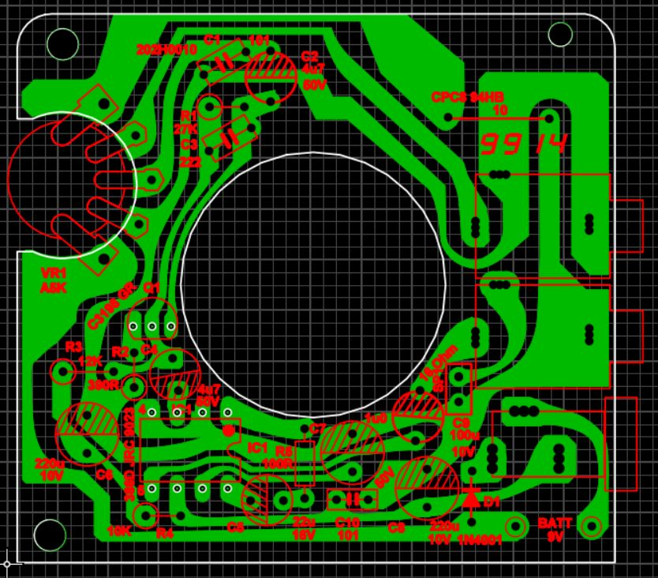

# archer-miniampclone
This is a clone of the old Archer 277-1008 mini amplifier PCB that Radio Shack used to sell.  This is of my design.  The last time I built these with OSH park, they worked just fine.  I didn't have a case, so I built one in an old Western Electric speakerphone enclosure. :)

BOM is in a text file in this repo as well; the design is very flexible as to tolerance and component type.  9V is the max voltage used, so keep that in mind when choosing capacitors; you don't need anything bigger than a 16V cap.

The gerbers are in the release file "v1.1.zip" - feel free to send these to [pcbway.com](https://www.pcbway.com) or your favorite board house to get them fabricated.

Please feel free to use it and expand upon it.  The schematic (original one) is included.

